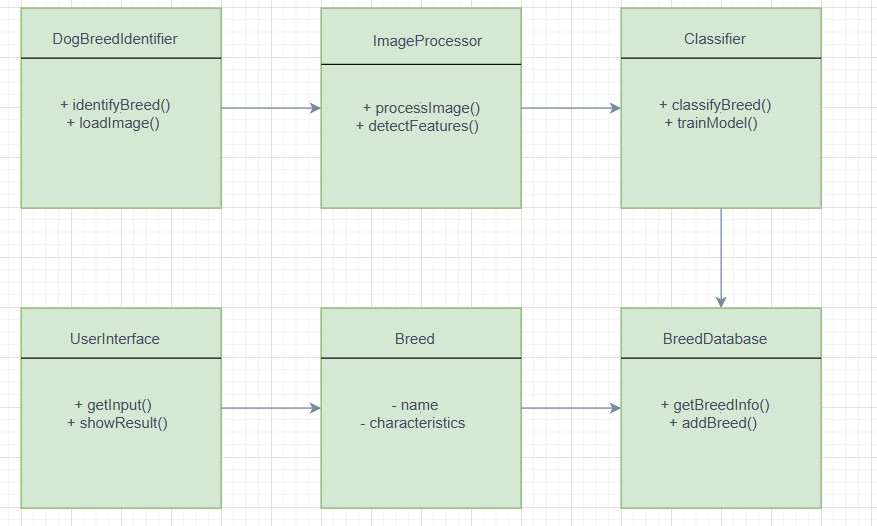

# HW5
### 類別圖

```big zone
圖例簡述：
1.DogBreedIdentifier 是主類別，整合所有功能。
2.ImageProcessor 負責處理用戶上傳的圖片，提取圖片特徵。
3.Classifier 使用機器學習模型來分析特徵並鑑定品種。
4.BreedDatabase 是一個儲存所有狗狗品種資料的數據庫。
5.Breed 類別表示單個狗狗品種的資訊，例如名稱和特徵。
6.UserInterface 負責與用戶互動，接收輸入並顯示結果。
```
### 循序圖


### 活動圖

